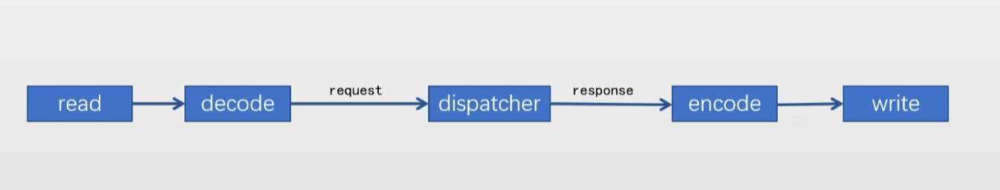

# rpc 过程




RPC 服务端流程
```
启动的时候就注册OrderService 对象。
1. 从buffer读取数据，然后 decode 得到请求的 TinyPBProtocol 对象。然后从请求的 TinyPBProtocol 得到 method_name, 从 OrderService 对象里根据 service.method_name 找到方法 func
2. 找到对应的 requeset type 以及 response type
3. 将请求体 TinyPBProtocol 里面的 pb_data 反序列化为 requeset type 的一个对象, 声明一个空的 response type 对象
4. func(request, response) 业务端逻辑
5. 将 reponse 对象序列为 pb_data。 再塞入到 TinyPBProtocol 结构体中。做 encode 然后塞入到buffer里面，就会发送回包了
```