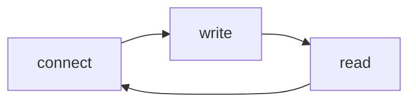

## TCP Client

connect: 连接对端机器

write: 将RPC响应发送到客户端

read: 读取客户端发来的数据，组装为rpc请求

## 非阻塞connect
* 返回0，表示连接成功
* 返回-1 但errno==EINPROGRESS，表示连接正在建立，此时可以添加到epoll中去监听其可写事件。等待可写事件就绪后，调用getsockopt获取fd上的错误，错误为0代表连接建立成功。
* 其他 `errno` 直接报错