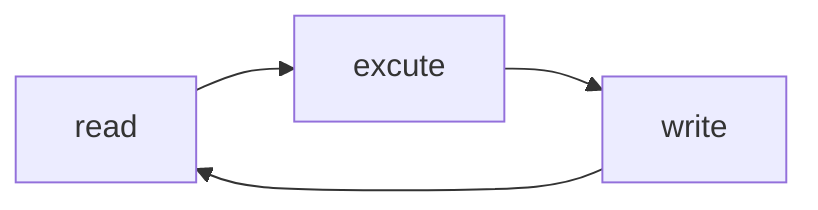

```mermaid
graph LR;
    A[read]-->B[excute];
    B-->C[write];
    C-->A;
```

## **read**: 
这里会有一个解码的请求，读取client发来的数据，组装成rpc请求

## **excute**: 
将RPC请求作为入参，执行业务逻辑得到RPC响应

## **write**: 
作为一个response编码 将RPC相应发送到client